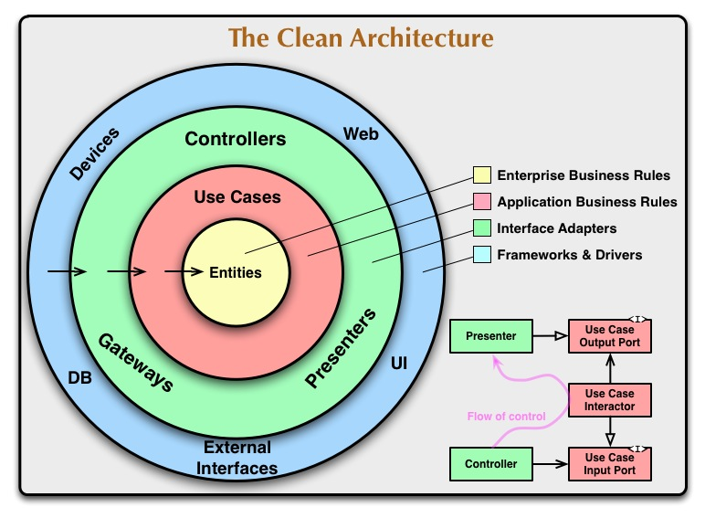
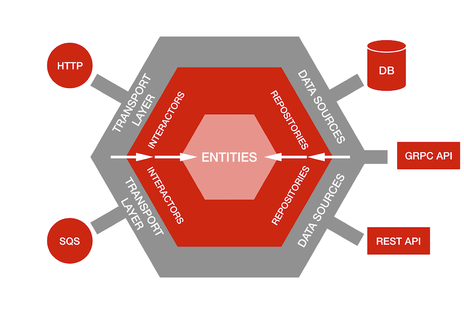

# Architecturing your service

In this chapter, we will see the principles of architecturing your application.

## The main principles

### DDD (domain driven design)

* Understand the business feature or problem first
* Use the business vocabulary
* Define the entities, the commands and the arguments attach to them
* Do not mix database, API in the domain methods and structs

#### going further with DDD

* [Microsoft](https://docs.microsoft.com/en-us/dotnet/architecture/microservices/microservice-ddd-cqrs-patterns/ddd-oriented-microservice)

### CQRS (command query request segregation)

Commands are the actions that modify your business entity.
Queries represents how you retrieve those entities.

* Separate your queries from your commands, they won't be using the same structs nor the same storage retrieval processes

#### going further with CQRS

* [throughtworks](https://www.thoughtworks.com/en-sg/insights/blog/domain-driven-design-services-architecture)

### Repository pattern

The repository pattern allows you to abstract the storage from the business domain.
If done well, it allows you to have a good unit test coverage and delegate the db implementation to a SQL fan.

Always have in mind: I want to be able to use a in memory store, as well as a database.

The big elephant in the room: transactions.

#### going further with the repository pattern

* [threedots.tech](https://threedots.tech/post/repository-pattern-in-go/)

### Event sourcing

See [the event sourcing chapter](../event-sourcing.md).

Event sourcing should be considered a specific implementation of the domain.

1. start with a classic implementation (with the repository pattern)
2. do another implementation using the event sourcing way (with the repo pattern as well)

This will add one more layer to your application, but it enforces a good separation of concerns.

### Clean/Onion/Hexa architectures

These architectures allow a great decoupling of the domain from the rest of the application.
Not only it allows you to have better test coverage, simpler code but it also allows developers to concurrently work on the same application, without too much communication overhead.

#### going further

* [from uncle bob himself](https://blog.cleancoder.com/uncle-bob/2012/08/13/the-clean-architecture.html)
* [netflix](https://netflixtechblog.com/ready-for-changes-with-hexagonal-architecture-b315ec967749)

## Reference public repositories

* [from user evrone](https://github.com/evrone/go-clean-template)
* [from watermill](https://github.com/ThreeDotsLabs/wild-workouts-go-ddd-example)

## Inspiration for good API structures and architectures

* [go-kit](https://github.com/go-kit/kit)
* [go-kratos](https://go-kratos.dev/)
